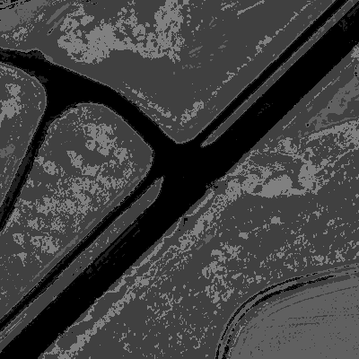

# Practical Assignment 1
**Dealine**: 01.04.2021

## Name: Bonaventure F. P. Dossou

## Foreword
### Implementation of a Minimal Classification System

## Problem 1 - Done successfully
### Feature Extraction (Points 10)

`First Feature vector == [132, 12, 73]`

## Problem 2 - Done successfully 
### Class Prior Probability (Points 25)

`Answer: The class that hasn't been represented in the training data is the class «car»`

`Submission Test PriorProbabilities: 17.2%   0.4%    59.5%   9.9%    13.0%   0.0%`

## Problem 3 - Done Successfully
### The Bayes Classifier (Points 50)

## Problem 4 - Done Successfully
### Decision Theory (Points 15)
Now, when both training and testing procedures are ready, we need to apply the decision theory in order to set proper label to every pixel of the testing image. 

In the testing procedure in the main.cpp file we classify the testing image using its features stored in the 002_fv.jpg file. The potentials for every pixel are returned from classifier into the `potentials` variable. Find the largest potential in `potentials` variable and assign the corresponding class label to the `classLabel` variable. Test your implementation. If everything is correct you should obtain 79,1% of accuracy and the class-map as follows:

